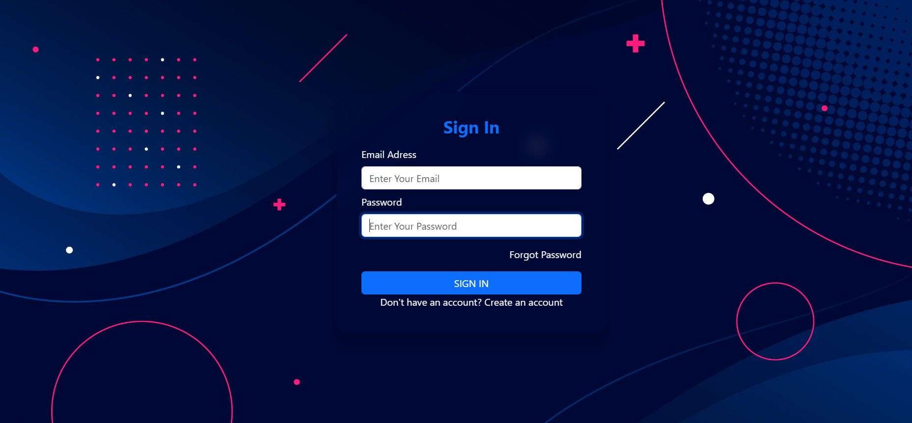

# CHAT-APP

🌐 **Real-time Communication Made Simple!**

A lightweight and stylish chat app leveraging the power of **HTML**, **CSS**, **JavaScript**, **PHP**, and **MySQL**. Perfect for quick messaging with a clean, responsive interface. 🚀

---

## 🌟 Features

✨ **Real-time messaging**: Chat seamlessly in real-time.<br>
✨ **Responsive design**: Enjoy a clean and stylish UI across all devices.<br>
✨ **Server-side scripting**: Powered by PHP for dynamic functionality.<br>
✨ **Database integration**: MySQL for efficient message storage.<br>
✨ **Lightweight and fast**: Optimized for performance and simplicity.

---

## 🛠️ Technologies Used

| Technology      | Purpose                     |
|-----------------|-----------------------------|
| **HTML**        | Structure of the app        |
| **CSS**         | Styling and layout          |
| **JavaScript**  | Dynamic behavior and logic  |
| **PHP**         | Backend for server handling |
| **MySQL**       | Database for message storage |

---

## 🚀 Getting Started

Follow these steps to set up the project locally:

### Prerequisites

Ensure you have the following installed:
- A modern web browser (e.g., Chrome, Firefox)
- A local server environment (e.g., XAMPP, WAMP, MAMP)
- MySQL database server
- Git for version control

### Installation

1. **Clone the Repository**:
   ```bash
   git clone https://github.com/yourusername/CHAT-APP.git
   ```

2. **Move to the Project Directory**:
   ```bash
   cd CHAT-APP
   ```

3. **Set Up the Database**:
   - Open your MySQL database client (e.g., phpMyAdmin).
   - Create a new database, e.g., `chat_app`.
   - Import the provided SQL file:
     ```
     import chat_app.sql
     ```

4. **Set Up a Local Server**:
   - Place the project folder in the `htdocs` directory (or equivalent for your server).
   - Configure the database connection in the `config.php` file.

5. **Launch the Application**:
   Open a browser and navigate to:
   ```
   http://localhost/CHAT-APP
   ```

---

## 📂 Project Structure

```
├── index.html      # Main HTML file
├── styles.css      # CSS for styling
├── script.js       # JavaScript for functionality
├── chat.php        # PHP for server-side logic
├── config.php      # PHP for database configuration
├── chat_app.sql    # SQL script to set up the database
└── README.md       # Project documentation
```

---

## 📸 Screenshots


*📌 Replace this placeholder with a screenshot of your app in action.*

---

## 🤝 Contributing

Contributions are always welcome! To contribute:

1. Fork this repository.
2. Create a new branch:
   ```bash
   git checkout -b feature/YourFeatureName
   ```
3. Commit your changes:
   ```bash
   git commit -m "Add YourFeatureName"
   ```
4. Push to the branch:
   ```bash
   git push origin feature/YourFeatureName
   ```
5. Open a Pull Request.

---

## 📜 License

This project is licensed under the **MIT License**. See the `LICENSE` file for more details.

---

🎨 **Enjoy customizing your chat experience! Let us know what you think.**
